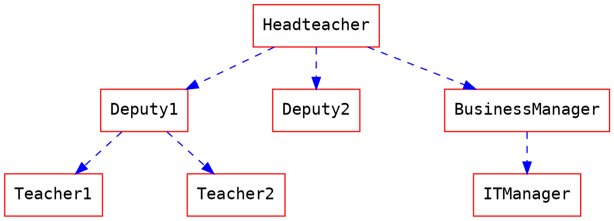
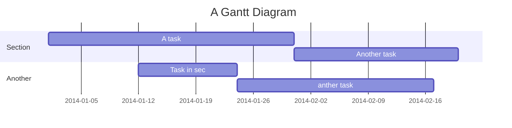

# HackMD 的 Markdown 格式速見表

## 速見表

| 選項              | 描述                                                                    |
| ----------------- | ----------------------------------------------------------------------- |
| 標題              | `# 標題 (有分隔線)`                                                     |
| 副標              | `## 副標`                                                               |
| 引言              | `> 引言`                                                                |
| 無序清單          | `- 清單`／`+ 清單`／`* 清單` 推薦同一層使用相同符號，不同層使用不同符號 |
| 有序清單          | `1. 有序清單`                                                           |
| 斜體              | `*斜線*`                                                                |
| 粗體              | `**粗體**`                                                              |
| 粗斜體            | `***粗斜體***`                                                          |
| 刪除線            | `~刪除線~`                                                              |
| 連結              | `[文字敘述](網址連結 "說明文字")`                                       |
| 連結 參照式寫法   | `[文字敘述] [參照id]`                                                   |
|                   | `[參照id]: 網址連結 "說明文字"`                                         |
| 圖片              | ``  |
| 程式碼區塊        | \`\`\` + [程式語言]，再加上 `=` 會顯示行號，並可指定行號數字            |
| 待辦事項          | `- [ ] Eat`                                                             |
| 內容一覽          | `[TOC]`                                                                 |
| 閱讀更多          | `<!-- more -->`                                                         |
| 嵌入 Youtube 影片 | ``                                          |
| 上標              | `19^th^`                                                                |
| 下標              | `H~2~O`                                                                 |
| 底線              | `++底線文字++`                                                          |
| 標記              | `==標記文字==`                                                          |
| 縮寫              | `*[HTML]: Hyper Text Markup Language`                                   |
| 跳脫字元          | `\` ，用以顯示 \\ \` \* \_ \{ \} \[ \] \( \) \# \+ \_ \. \!             |

### HackMD 主題



- 對話介面： `{`%hackmd @yukai/conversational-theme %`}`
  使用 `---` 區隔每段對話與發言人
- Medium 風格： `{`%hackmd @yukai/medium-theme %`}`
- 自製主題： `{`%hackmd @f6bfb5/Hyhn12gUI %`}`

### [YAML metadata](https://hackmd.io/yaml-metadata)

```md
---
title: 設定筆記標題
description: 設定筆記描述
image: 設定筆記預設圖片 (用於連結預覽)
tags: 設定筆記標籤
robots: 設定網路機器人 meta
lang: 設定瀏覽器顯示語言
dir: 設定文字方向
breaks: 設定是否使用分行
GA: 設定 Google Analytics
disqus: 設定 Disqus
slideOptions: 設定簡報模式的選項
  theme: solarized   # 顏色主題
  transition: 'fade' # 換頁動畫
  # parallaxBackgroundImage: 'https://s3.amazonaws.com/hakim-static/reveal-js/reveal-parallax-1.jpg'
  spotlight:
    enabled: true
  allottedMinutes: 5  # 預計一張簡報花幾分鐘
---
```

## 表格

向右對齊
`| ------:| -----------:|`

向左對齊
`|:------ |:----------- |`

置中對齊
`| :------: | :-----------: |`

## 引用區塊標籤

> 您可以使用以下語法，表明自己的 **姓名、時間與顏色** 並與其他的引用區塊做區別
> [name=ChengHan Wu] [time=Sun, Jun 28, 2015 9:59 PM] [color=#907bf7]
>
> > 也支援巢狀引用區塊喔！
> > [name=ChengHan Wu] [time=Sun, Jun 28, 2015 10:00 PM] [color=red]

```md
> 您可以使用以下語法，表明自己的 **姓名、時間與顏色** 並與其他的引用區塊做區別
> [name=ChengHan Wu] [time=Sun, Jun 28, 2015 9:59 PM] [color=#907bf7]
>
> > 也支援巢狀引用區塊喔！
> > [name=ChengHan Wu] [time=Sun, Jun 28, 2015 10:00 PM] [color=red]
```

## 警告區塊

:::success
耶 :tada:
:::

:::info
這是訊息 :mega:
:::

:::warning
注意 :zap:
:::

:::danger
喔不 :fire:
:::

```md
:::success
耶 :tada:
:::

:::info
這是訊息 :mega:
:::

:::warning
注意 :zap:
:::

:::danger
喔不 :fire:
:::
```

## 書本模式

- 大標 (於 `===` 前一行的文字) 會變為書本標題
- 副標 (於 `---` 前一行的文字) 會變為章節標題
- 無排序清單項目 (於 `-` 後方的文字) 的連結會變為章結內容連結
- 連結為其它 HackMD 的文章
- 需於右上方的分享內，改為書本模式

## 簡報模式

- 以分隔線 (`---`) 區隔每張投影片，使用 `→` 鍵切換
- 可以四個連字號 (`----`) 區隔章節內的投影片，使用 `↓` 鍵切換
- 連字號前後都需要有空行
- 需於右上方的分享內，改為書本模式
- 簡報模式時按下 `ESC` 鍵可進入總覽模式
- 簡報模式時按下 `s` 鍵可進入講者模式
- 可使用 YAML 標頭設定自訂整份簡報選項
- 可使用註記語法 (如 `<!-- .slide: -->`) 自訂單頁簡報樣式

### 可用的 YAML 設定值

```yaml
# Display controls in the bottom right corner
controls: true

# Display a presentation progress bar
progress: true

# Set default timing of 2 minutes per slide
defaultTiming: 120

# Display the page number of the current slide
slideNumber: false

# Push each slide change to the browser history
history: false

# Enable keyboard shortcuts for navigation
keyboard: true

# Enable the slide overview mode
overview: true

# Vertical centering of slides
center: true

# Enables touch navigation on devices with touch input
touch: true

# Loop the presentation
loop: false

# Change the presentation direction to be RTL
rtl: false

# Randomizes the order of slides each time the presentation loads
shuffle: false

# Turns fragments on and off globally
fragments: true

# Flags if the presentation is running in an embedded mode,
# i.e. contained within a limited portion of the screen
embedded: false

# Flags if we should show a help overlay when the questionmark
# key is pressed
help: true

# Flags if speaker notes should be visible to all viewers
showNotes: false

# Global override for autolaying embedded media (video/audio/iframe)
# - null: Media will only autoplay if data-autoplay is present
# - true: All media will autoplay, regardless of individual setting
# - false: No media will autoplay, regardless of individual setting
autoPlayMedia: null

# Number of milliseconds between automatically proceeding to the
# next slide, disabled when set to 0, this value can be overwritten
# by using a data-autoslide attribute on your slides
autoSlide: 0

# Stop auto-sliding after user input
autoSlideStoppable: true

# Use this method for navigation when auto-sliding
autoSlideMethod: Reveal.navigateNext

# Enable slide navigation via mouse wheel
mouseWheel: false

# Hides the address bar on mobile devices
hideAddressBar: true

# Opens links in an iframe preview overlay
previewLinks: false

# Transition style
transition: "slide"
# none/fade/slide/convex/concave/zoom

# Transition speed
transitionSpeed: "default"
# default/fast/slow

# Transition style for full page slide backgrounds
backgroundTransition: "fade"
# none/fade/slide/convex/concave/zoom

# Number of slides away from the current that are visible
viewDistance: 3

# Parallax background image
parallaxBackgroundImage: ""
# e.g. "'https://s3.amazonaws.com/hakim-static/reveal-js/reveal-parallax-1.jpg'"

# Parallax background size
parallaxBackgroundSize: ""
# CSS syntax, e.g. "2100px 900px"

# Number of pixels to move the parallax background per slide
# - Calculated automatically unless specified
# - Set to 0 to disable movement along an axis
parallaxBackgroundHorizontal: null
parallaxBackgroundVertical: null

# The display mode that will be used to show slides
display: "block"

# Enable spotlight mode
spotlight:
  enabled: true

# Enable timer (in minutes)
allottedMinutes: 5
```

### 可用的註記語法

```
更換背景顏色
<!-- .slide: data-background="#CC0000" -->

淡入淡出
- 淡出1<!-- .element: class="fragment" data-fragment-index="1" -->
- 淡出2<!-- .element: class="fragment" data-fragment-index="2" -->
- 淡出3<!-- .element: class="fragment" data-fragment-index="3" -->
- 淡出4<!-- .element: class="fragment" data-fragment-index="4" -->

轉場動畫
<!-- .slide: data-transition="fade" -->
<!-- .slide: data-transition="slide" -->
<!-- .slide: data-transition="convex" -->
<!-- .slide: data-transition="concave" -->
<!-- .slide: data-transition="zoom" -->

設定不同的進入及離開效果
<!-- .slide: data-transition="fade-in convex-out" -->

自訂轉場的速度
<!-- .slide: data-transition-speed="default" -->
<!-- .slide: data-transition-speed="fast" -->
<!-- .slide: data-transition-speed="slow" -->
```

## 註腳

註角會顯示在整個頁面的最下方

註腳 1 連結[^first]
註腳 2 連結[^second]
行內註腳^[行內註腳的文字] 定義
重複註腳[^second]

[^first]:
    註腳 **也可以使用標記**
    還可以加上段落

[^second]: 註腳 文字

```md
註腳 1 連結[^first].
註腳 2 連結[^second].
行內註腳^[行內註腳的文字] 定義
重複的註腳參考[^second].

[^first]:
    註腳 **也可以標記**
    還可以有很多段落

[^second]: 註腳 文字
```

## 定義清單

名詞 1
: 定義 1 快速連續項目

名詞 2 加上 _行內標記_
: 定義 2
{ 這些程式碼屬於 定義 2 的一部分 }
定義 2 的第三段落

```md
名詞 1
: 定義 1 快速連續項目

名詞 2 加上 _行內標記_
: 定義 2
{ 這些程式碼屬於 定義 2 的一部分 }
定義 2 的第三段落
```

_緊密樣式：_

名詞 1
~ 定義 1

名詞 2
~ 定義 2a
~ 定義 2b

```md
名詞 1
~ 定義 1

名詞 2
~ 定義 2a
~ 定義 2b
```

## 圖表

### 1. UML 圖表 循序圖

```sequence
艾莉絲->包柏: 哈摟，你好嗎？
Note right of 包柏: 包柏思考中
包柏-->艾莉絲: 我很好，謝謝！
Note left of 艾莉絲: 艾莉絲回應
艾莉絲->包柏: 最近過得怎樣？
```

### 2. 流程圖

```flow
st=>start: 開始
e=>end: 結束
op=>operation: 我的操作
op2=>operation: 啦啦啦
cond=>condition: 是或否？

st->op->op2->cond
cond(yes)->e
cond(no)->op2
```

### 3. Graphviz



### 4. Mermaid

- [superj80820/mermaid-js-converter](https://github.com/superj80820/mermaid-js-converter)




### 5. Vega

```vega
{
  "$schema": "https://vega.github.io/schema/vega-lite/v4.json",
  "data": {"url": "https://vega.github.io/editor/data/barley.json"},
  "mark": "bar",
  "encoding": {
    "x": {"aggregate": "sum", "field": "yield", "type": "quantitative"},
    "y": {"field": "variety", "type": "nominal"},
    "color": {"field": "site", "type": "nominal"}
  }
}
```

### 折疊內容

<details>
  <summary>
    Qiita(キータ)は、プログラマのための技術情報共有サービスです。
  </summary>
  プログラミングに関することをどんどん投稿して、知識を記録、共有しましょう。
  Qiitaに投稿すると、自分のコードやノウハウを見やすい形で残すことができます。
  技術情報はテキストファイルへのメモではなく、タグを付けた文章、シンタックスハイライトされたコードで保存することで初めて再利用可能な知識になる、そうQiitaでは考えています。
</details>

```html
<details>
  <summary>
    Qiita(キータ)は、プログラマのための技術情報共有サービスです。
  </summary>
  プログラミングに関することをどんどん投稿して、知識を記録、共有しましょう。
  Qiitaに投稿すると、自分のコードやノウハウを見やすい形で残すことができます。
  技術情報はテキストファイルへのメモではなく、タグを付けた文章、シンタックスハイライトされたコードで保存することで初めて再利用可能な知識になる、そうQiitaでは考えています。
</details>
```

## 參考連結

- [官方使用教學](https://hackmd.io/c/tutorials-tw/)
- [HackMD 的投影片輸入格式對照表](/s/sWqyfWyFRRuWXWV_Cj2X7w)
- [Markdown を活用するためのフローチャート](https://qiita.com/gat3ta/items/5abb2c9448331397a94b)
- [Markdown テキストでシーケンス図とフローチャートを描く](https://qiita.com/ka215/items/a709665cb34c505ccf1f)
- [更多關於 **循序圖** 語法](http://bramp.github.io/js-sequence-diagrams/)
- [更多關於 **流程圖** 語法](http://adrai.github.io/flowchart.js/)
- [更多關於 **graphviz** 語法](http://www.tonyballantyne.com/graphs.html)
- [更多關於 **mermaid** 語法](http://knsv.github.io/mermaid)
- [【目的無しの泥臭調査 ⑤】mermaid.js の記法を覚えて、楽しく図を描く。](https://qiita.com/t_o_d/items/ac5b04419252f768a535)
- [更多關於 **vega** 語法](https://vega.github.io/vega-lite/docs)
- [Markdownでシーケンス図とかが書けるMermaid記法で業務フローを書いたら意外とイケたので自分なりのコツを紹介してみる](https://dev.classmethod.jp/articles/workflow-tips-with-mermaid/)
- [Open-source tool that uses simple textual descriptions to draw beautiful UML diagrams.](https://plantuml.com/en/)
- [Font Awesome 4](https://fontawesome.com/v4.7.0/icons/)
