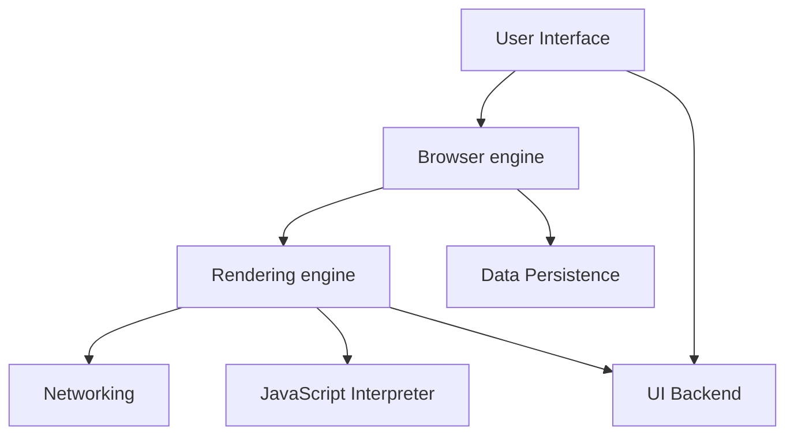

## How is browser rendering content

- [電子情報学特論：Chromium のアーキテクチャを解き明かす](https://docs.google.com/presentation/d/12wd3hLkXVny0b5LnzizmH_3xe8zJ2WY5_9JprfIkp-o/)
- [Web ページがブラウザに表示されるまでに何が起こるのか？](https://zenn.dev/ak/articles/61d25099295372)
- [ブラウザレンダリング入門〜知ることで見える世界〜](https://qiita.com/codemafia0000/items/caed57ec30d638e40728)
- [身為 Web 工程師，你應該要知道的瀏覽器架構演進史 feat.渲染引擎運作機制](https://medium.com/starbugs/%E8%BA%AB%E7%82%BA-web-%E5%B7%A5%E7%A8%8B%E5%B8%AB-%E4%BD%A0%E6%87%89%E8%A9%B2%E8%A6%81%E7%9F%A5%E9%81%93%E7%9A%84%E7%80%8F%E8%A6%BD%E5%99%A8%E6%9E%B6%E6%A7%8B%E6%BC%94%E9%80%B2%E5%8F%B2-feat-%E6%B8%B2%E6%9F%93%E5%BC%95%E6%93%8E%E9%81%8B%E4%BD%9C%E6%A9%9F%E5%88%B6-6d95d4d960ee)
- [Webブラウザのレンダリングの仕組みを理解する](https://zenn.dev/oreo2990/articles/280d39a45c203e)

```
                 --------------
               | User Interface |  --------
                 --------------            |
                       |                   |
                       v                   |
                 --------------            |           ----------------
               | Browser engine |  --------|-------> | Data Persistence |
                 --------------            |           ----------------
                       |                   |
                       v                   |
                 ----------------          |
           --  | Rendering engine |  -     |
          |      ----------------     |    |
          |             |             |    |         
          v             v             v    v
  ----------        -----------        ----------
| Networking |    | JavaScript  |    | UI Backend |
  ----------      | Interpreter |      ----------
                    -----------
```



## How to get better rendering performance

- [フロントエンドのパフォーマンスチューニングを俯瞰する - 30 歳からのプログラミング](https://numb86-tech.hatenablog.com/entry/2021/05/05/224611)
- [How to 速度改善 ー Web パフォーマンスについて知っておきたいこと 7 選ー](https://qiita.com/masanarih0ri/items/1c6b856da0bd04bed995)
- [今晚，我想來點 Web 前端效能優化大補帖！](https://medium.com/starbugs/%E4%BB%8A%E6%99%9A-%E6%88%91%E6%83%B3%E4%BE%86%E9%BB%9E-web-%E5%89%8D%E7%AB%AF%E6%95%88%E8%83%BD%E5%84%AA%E5%8C%96%E5%A4%A7%E8%A3%9C%E5%B8%96-e1a5805c1ca2)
- [Web フロントエンドパフォーマンスチューニング 55 選](https://qiita.com/nuko-suke/items/50ba4e35289e98d95753)
