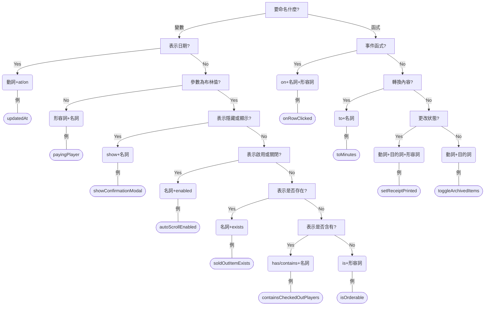

# 如何命名

- [初心者プログラマーのための英語命名法](https://qiita.com/YutaManaka/items/62dda256bb7ba6c08399)
- [あいまいを避けて勘違いの起きない命名をするための体系的分類と言語学的説明](https://qiita.com/honey32/items/4ea8833cc8bf5047df6e)
- [プログラミングでよく使う英単語のまとめ【随時更新】](https://qiita.com/Ted-HM/items/7dde25dcffae4cdc7923)
- [Naming -名前付け-](https://qiita.com/Koki_jp/items/f3d3e824f98d182d4100)

```flow
start=>start: Start
naming=>parallel: 要命名什麼?

date=>condition: 表示日期?
dateOp=>operation: 動詞+at/on
boolean=>condition: 參數為布林值?
booleanOp=>operation: 形容詞+名詞
show=>condition: 表示隱藏或顯示?
showOp=>operation: show+名詞
enable=>condition: 表示啟用或關閉?
enableOp=>operation: 名詞+enabled
exist=>condition: 表示是否存在?
existOp=>operation: 名詞+exists
has=>condition: 表示是否含有?
hasOp=>operation: has/contains+名詞
varOp=>operation: is+形容詞

on=>condition: 事件函式?
onOp=>operation: on+名詞+形容詞
to=>condition: 轉換內容?
toOp=>operation: to+名詞
status=>condition: 更改狀態?
statusOp=>operation: 動詞+目的詞+形容詞
funOp=>operation: 動詞+目的詞

start->naming
naming(path1, bottom)->date
naming(path2,right)->on

date(yes, right)->dateOp
date(no, bottom)->boolean
boolean(no, right)->booleanOp
boolean(yes, bottom)->show
show(yes, right)->showOp
show(no, bottom)->enable
enable(yes, right)->enableOp
enable(no, bottom)->exist
exist(yes, right)->existOp
exist(no, bottom)->has
has(yes, right)->hasOp
has(no, bottom)->varOp

on(yes, right)->onOp
on(no, bottom)->to
to(yes, right)->toOp
to(no, bottom)->status
status(yes, right)->statusOp
status(no, bottom)->funOp
```



## 名詞小技巧

- 名詞+名詞也 OK
  - codeOfError -> errorCode
- 注意名詞單複數
- 盡量不使用不可數名詞
  - getTexts
- 標注型別會更好
  - terminalIdsArray
- 不寫得太細
  - allItems -> items
- 妥善運用 without, before, after
  - itemQuantityAfterOrder

## 形容詞小技巧

- 動詞被動式也 OK
  - deletedPlayer
- 進行式形容詞
  - payingPlayer
- 妥善使用否定形容詞
  - uncategorized, incomplete
- 不要使用雙重否定
  - !disabled -> enabled
